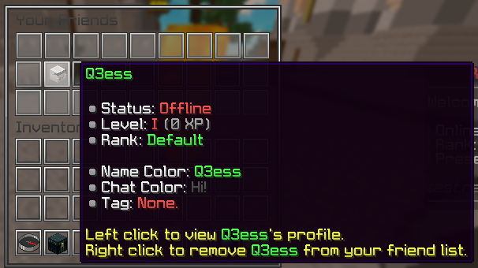

pxFriends adds a way for players to add and manage friends in game.

You can join your friends server and view their profile using the friends menu.

## Friends Menu

View your added friends and perform related actions
such as viewing their profile or teleporting to them.

Screenshot

## Commands

`<>` = Required `[]` = Optional

Command                   | Permission | Description
------------------------- | ---------- | ---------------------------------------
`/friend accept <player>` | None       | Accepts a friend request.
`/friend add <player>`    | None       | Sends a friend request to a player.
`/friend clear`           | None       | Clears your friend list.
`/friend deny <player>`   | None       | Denies a friend request.
`/friend list [page]`     | None       | Lists your friends.
`/friend remove <player>` | None       | Removes a friend from your friend list.
`/friend requests [page]` | None       | Lists active incoming friend requests.

## Permissions

This addon has no permissions.