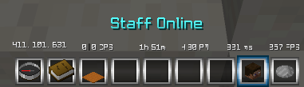
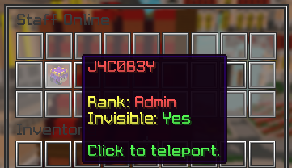
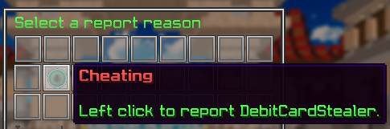
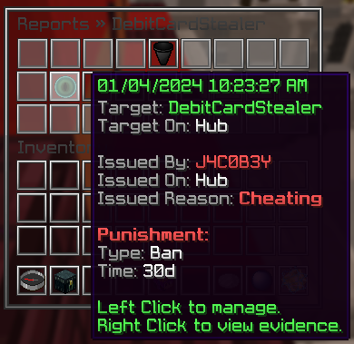

pxStaff is an all-in-one moderation system to assist
staff members in managing players.

Reports, requests, freezing, mod mode and vanish act
as tools for more practical moderation techniques.

## Vanish

Vanish allows staff to be hidden to players and other staff below their rank.

## Mod Mode

Mod mode gives staff members staff-related items to help with moderation duty.

It will also automatically vanish them, if configured.

Screenshots

## Reports

Menus

## Commands

`<>` = Required `[]` = Optional

Command                 | Permission                 | Description
----------------------- | -------------------------- | ---------------------------------
`/amivanished`          | `core.command.vanish`      | Checks if you are vanished.
`/freeze <player>`      | `core.command.freeze`      | Freezes a player.
`/invsee <player>`      | `core.command.invsee`      | Opens a players inventory.
`/clearchat`            | `core.command.clearchat`   | Clears the chat.
`/mutechat`             | `core.command.mutechat`    | Mutes the chat.
`/slowchat <seconds>`   | `core.command.slowchat`    | Slows the chat.
`/modmode [player]`     | `core.command.modmode`     | Toggles mod mode.
`/pxstaff reload`       | `pxstaff.command.reload`   | Reloads pxStaff.
`/request <message>`    | `core.command.request`     | Request help from a staff member.
`/requestmute <player>` | `core.command.requestmute` | Requests to mute a player.
`/vanish [player]`      | `core.command.vanish`      | Vanishes yourself or a player.
`/hidestaff`            | `core.command.hidestaff`   | Hides staff members.

### Report Commands

`<>` = Required `[]` = Optional

Command                                                  | Permission                 | Description
-------------------------------------------------------- | -------------------------- | -----------------------------------------
`/report <player>`                                       | `core.command.report`      | Reports a player.
`/reports <player>`                                      | `core.command.reports`     | View reports towards a player.
`/reports-all`                                           | `core.command.reportsall`  | View all open reports.
`/adminreport create <id> <ladder> <material> <display>` | `core.command.adminreport` | Creates a report category.
`/adminreport delete <category>`                         | `core.command.adminreport` | Deletes a report category.
`/adminreport displayName <category> [display/ladder]`   | `core.command.adminreport` | Changes a report category's display name.
`/adminreport material <category> <material>`            | `core.command.adminreport` | Changes a report category's material.
`/adminreport description <category>`                    | `core.command.adminreport` | Changes a report category's description.

## Permissions

For a complete list of all permissions, please check out [Phoenix/Permissions/pxStaff](/Phoenix/Permissions#pxstaff).