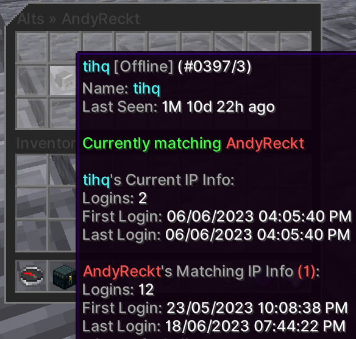

The alts system allows admins to view players that share the same IP address. 
This helps detect punishment evasion. You can view alts through a menu or a command.

You will see punishment status' of each alt and their IP information.

## Alts Menu

The alts menu can be opened by using the command `/altsmenu <player>`

Permission: `core.command.alts`

Screenshot

## Commands

`<>` = Required `[]` = Optional

Command              | Permission          | Description
-------------------- | ------------------- | --------------------------------
`/altsmenu <player>` | `core.command.alts` | Opens the alts menu.
`/alts <player>`     | `core.command.alts` | Displays player alt information.