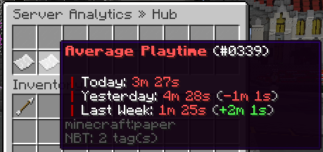

View tracked analytics including logins, average playtime, player peaks and more.

## Analytics Menu

The analytics menu shows a specific server's analytics.

It can be opened with the `/analytics view` command.

Screenshot

## Commands

`<>` = Required `[]` = Optional

Command                    | Permission               | Description
-------------------------- | ------------------------ | ----------------------------------
`/analytics total`         | `core.command.analytics` | View global alalytics.
`/analytics view <server>` | `core.command.analytics` | View a specific server's analytics
