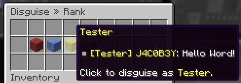
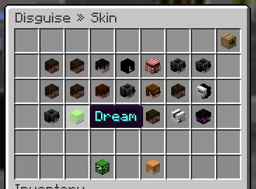

When disguising, your disguise name, skin and rank can be chosen,
these changes will be reflected on all servers.

Staff alerts are sent when a player disguises, undisguises or redisguises.

## Menus

Screenshots

## Commands

`<>` = Required `[]` = Optional

Command            | Permission                | Description
------------------ | ------------------------- | ---------------------------------
`/disguise [name]` | `core.command.disguise`   | Opens the disguise menu.
`/undisguise`      | `core.command.undisguise` | Removes your current disguise.
`/redisguise`      | `core.command.redisguise` | Reapplies your previous disguise.

## Admin Commands

`<>` = Required `[]` = Optional

Command                                                   | Permission                                 | Description
--------------------------------------------------------- | ------------------------------------------ | --------------------------------------------------
`/user disguise <player> [rank]`                          | `core.command.user.disguise`               | Rank disguises a player, no rank undisguises them.
`/disguiseadmin disguise <rank> <player> <skin> <target>` | `core.command.disguiseadmin`               | Disguises an online player.
`/disguiseadmin undisguise <player>`                      | `core.command.disguiseadmin.undisguise`    | Undisguises an online player.
`/disguiseadmin listdisguised`                            | `core.command.disguiseadmin.listdisguised` | Lists all online disguised players.
`/disguiseadmin checkdisguise <player>`                   | `core.command.disguiseadmin.checkdisguise` | Checks a player's current disguise.
`/disguiseadmin history <player>`                         | `core.command.disguiseadmin.history`       | Checks a player's disguise history.
