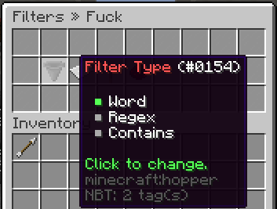

Filters are a way to stop players from typing disallowed words or terms.

## Filter Edit Menu

The filter edit menu allows you to toggle the type, ladder, hard, and autopunish.

It can be opened with the `/filter edit` command.

Screenshot

## Commands

`<>` = Required `[]` = Optional

Command                                                    | Permission            | Description
---------------------------------------------------------- | --------------------- | -----------------------------------
`/filter create <name> <filter> <type> [punishmentLadder]` | `core.command.filter` | Creates a filter.
`/filter delete <filter>`                                  | `core.command.filter` | Deletes a filter.
`/filter edit <filter>`                                    | `core.command.filter` | Opens the filter edit menu.
`/filter hard <filter> <hard>`                             | `core.command.filter` | Toggles a filters boner.
`/filter list [page]`                                      | `core.command.filter` | Lists filters.
`/filter test <text>`                                      | `core.command.filter` | Tests if a phrase matches a filter.
