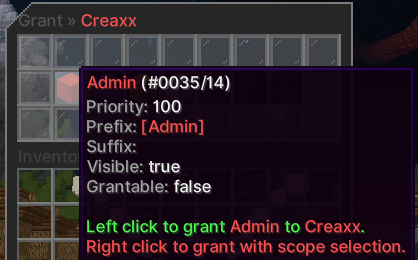
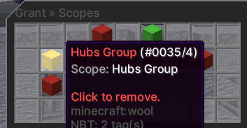
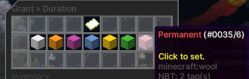
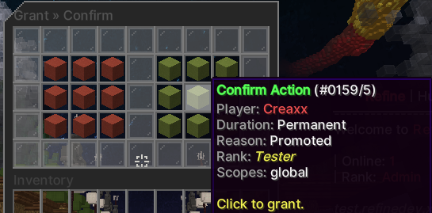
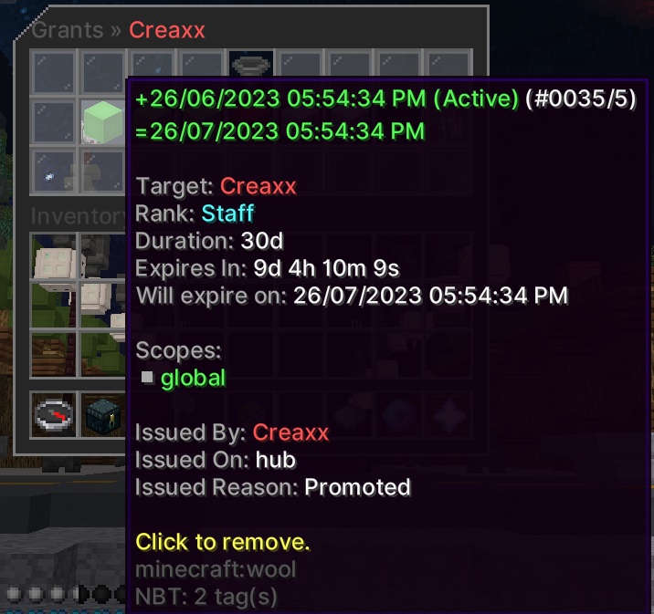
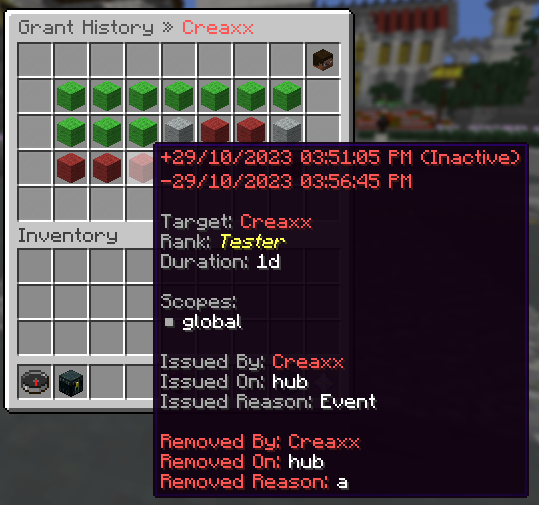

A grant adds a rank to player for a set duration, which is determined as the grant is created. The duration can be permanent or temporary.

Each grant has a scope, which is a single or group of servers that the grant applies on. The scope can be `global`, which means the player will have that rank on all servers.

A reason has to be specified for each grant, either using your preset grant reasons, or a custom reason.

## Grant Menu

The grant menu is where you create a grant to be applied to a player.

Permission: `core.command.grant`

You need a permission to grant each rank, for example: `core.grant.vip` which grants the vip rank. You can use `core.grant.*` to allow all ranks.

Screenshots

## Grants Menu

The grants menu lists all current and expired grants that a player has. You can revoke grants from this menu aswell.

Permission: `core.command.grants`

The same permission to grant a rank allows you to remove a grant, see above.

Screenshot

## Grant History Menu

The grant history menu lists all grants a staff member has created.

Permission: `core.command.granthistory`

Screenshot

## Commands

`<>` = Required `[]` = Optional

Command                                               | Permission                  | Description
----------------------------------------------------- | --------------------------- | -----------------------------
`/grant <player>`                                     | `core.command.grant`        | Opens the grant menu.
`/grants <player>`                                    | `core.command.grants`       | Opens the grants menu.
`/granthistory <player>`                              | `core.command.granthistory` | Opens the grant history menu.
`/ogrant <player> <rank> <duration> <scope> <reason>` | Console Only                | Creates a grant for a player.
`/rgrant <player> <rank> <reason>`                    | Console Only                | Removes grants for a player.
