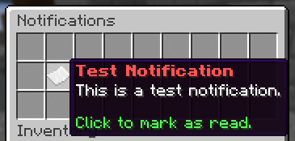

Staff can create notifications with a custom title and lore. 

Players will the get a message upon joining the server saying they have an unread notification.

## Menu

The notification menu shows all your unread notifications,
click a notification to mark it as read.

Screenshot

## Stats

Staff can view statistics about notifications using the `/notifications stats` command.

Menu

## Commands

`<>` = Required `[]` = Optional

Command                                       | Permission                          | Description
--------------------------------------------- | ----------------------------------- | ---------------------------------------------------------
`/notifications`                              | None                                | Opens the notifications menu.
`/notifications all`                          | None                                | Opens the notifications menu (with closed notifications).
`/notifications list [page]`                  | `core.command.notifications.list`   | Lists all notifications.
`/notifications create <id>`                  | `core.command.notifications.create` | Creates a notification.
`/notifications delete <notification>`        | `core.command.notifications.delete` | Deletes a notification.
`/notifications title <notification> <title>` | `core.command.notifications.title`  | Sets the title of a notification.
`/notifications lore <notification>`          | `core.command.notifications.lore`   | Opens the notification lore edit menu.
`/notifications stats <notification>`         | `core.command.notifications.stats`  | Opens the notification statistics menu.
