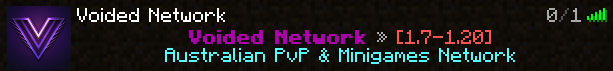
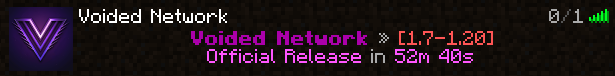
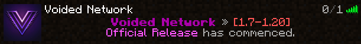

Adding the pxBungee or pxVelocity plugin to your proxy adds additional features.

Features

- Staff join, leave and switch messages.
- Anti VPN.
- Maintenance.
- Server List MOTD.
- Additional [Commands](#commands).

## Anti VPN

The antivpn stops players connected using a vpn from joining the proxy.

If a player required a vpn to join, you can add them to the antivpn bypass.

### Providers

Provider     | Description
------------ | ----------------------------------------------
`IPRisk`     | Free, less accurate then ProxyCheck.
`ProxyCheck` | Paid, requires an API key, better than IPRisk.

### AntiVPN Commands

Command                    | Permission             | Description
-------------------------- | ---------------------- | -----------------------------------------
`/antivpn check <player>`  | `core.command.antivpn` | Checks a player's antivpn data.
`/antivpn add <player>`    | `core.command.antivpn` | Adds a player to a antivpn bypass.
`/antivpn remove <player>` | `core.command.antivpn` | Removes a player form the antivpn bypass.
`/antivpn list`            | `core.command.antivpn` | Lists players in the antivpn bypass.

## Maintenance

Maintenance is a whitelist system but for your proxy.

### Access

There are two access types, UUID and Rank.

Access Type | Description
----------- | ---------------------------------------------------------------
`UUID`      | Uses a list of uuids that should be allowed to join.
`Rank`      | Ranks with greater then or equal priority will be able to join.

### Maintenance Commands

`<>` = Required `[]` = Optional

Command                                 | Permission                 | Description
--------------------------------------- | -------------------------- | --------------------------------------
`/maintenance access <access> [rank]`   | `core.command.maintenance` | Sets the maintenance access type.
`/maintenance add <player> <permanent>` | `core.command.maintenance` | Adds a player to the maintenance.
`/maintenance info`                     | `core.command.maintenance` | Displays maintenance information.
`/maintenance remove <player>`          | `core.command.maintenance` | Removes a player from the maintenance.
`/maintenance toggle [true/false]`      | `core.command.maintenance` | Toggles the maintenance.

## MOTD

Screenshots

### Timer Commands

Command              | Permission           | Description
-------------------- | -------------------- | ---------------------------
`/timer toggle`      | `core.command.timer` | Toggles a timer.
`/timer name <name>` | `core.command.timer` | Sets the name of the timer.
`/timer time <time>` | `core.command.timer` | Sets the time of the timer.

## Commands

:::info
All commands below support cross proxy.
:::

`<>` = Required `[]` = Optional

Command          | Permission                           | Description
---------------- | ------------------------------------ | -------------------------------------------------
`/bungeereload`  | `core.command.bungeereload`          | Reloads the phoenix proxy plugin.
`/domainstats`   | `core.command.domainstats`           | Lists domains used to connect in order of joins.
`/find <player>` | `core.command.find`                  | Displays what server a player is connect to.
`/glist`         | `core.command.glist`                 | Lists all players connected on all proxies.
`/hub`           | `core.command.hub`                   | Connects to a hub server.
`/join <server>` | `core.join.<server>` / `core.join.*` | Joins a server.
`/jump <player>` | `core.command.jump`                  | Jumps to a player's server.
`/pull <player>` | `core.command.pull`                  | Pulls a player to the server you're connected to.

## Send Commands

:::info
All commands below support cross proxy.
:::

`<>` = Required `[]` = Optional

Command                          | Permission          | Description
-------------------------------- | ------------------- | --------------------------------------------------------------
`/send all <server>`             | `core.command.send` | Send all players to a server.
`/send current <server>`         | `core.command.send` | Send all players in your current server to a different server.
`/send server <server> <to>`     | `core.command.send` | Send all players in a server to a different server.
`/send player <player> <server>` | `core.command.send` | Send a player to a server.

<!-- 

J4C0B3Y - 5/4/24

Please help me, ive been doing docs for weeks without sleep.
Creaxx is torturing me in his basement, please free me.

If he finds out im crying out for help, i will be punished.

-->
