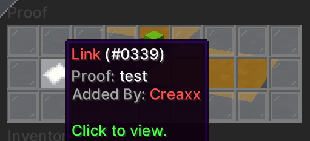
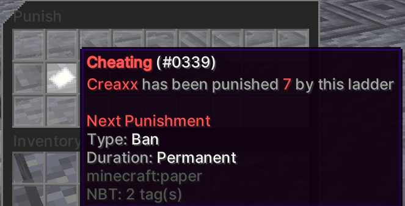
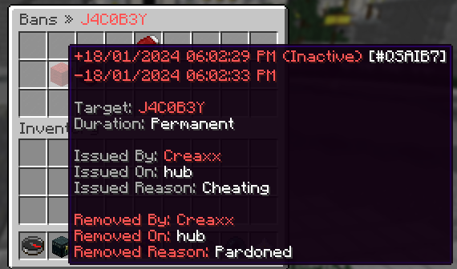

Punishments allow staff members to take disciplinary action against players behavior. The punishment types include blacklists, bans, mutes, shadow mutes, kicks, warns and competative bans.

Punishments can be temporary or permanent, they can also be applied to a players IP address, so it applies to all of their [alts](/Phoenix/Features/Alts).

Shadow mutes make a player think other players can see their messages in chat but they cant, while a normal mute prevents them from chatting altogether.

A player can be punished through commands or by using the punish menu which allows the use of punishment ladders, this is the recommended way.

# Punishment Ladders

Punishment ladders are a sequential list of punishments that apply to a player depending on how many times they have been banned by the ladder.

Punishment ladders can be used with the punish command or through resolving reports as true.

# Proof

The proof menu is where you can attach a link or chat snapshot to a punishment, for example a chat snapshot can be attached if the player was muted.

Screenshot

# Punish Menu

The punish menu is where a staff member can punish a player using the punishment ladders.

Permission: `core.command.punish`

The `core.punish.<ladder>` permission is also required for the use of a punishment ladder in the menu.

Screenshot

# History Menu

The history menu lists all current and past punishments a player has had.

Permission: `core.command.history`

Screenshot

# Commands

`<>` = Required `[]` = Optional `-s` = Silent `-p` = Public

Command                                                | Permission                    | Description
------------------------------------------------------ | ----------------------------- | --------------------------------------
`/punish <player>`                                     | `core.command.punish`         | Opens the punish menu.
`/lookup <id>`                                         | `core.command.lookup`         | Looks up a punishment.
`/removewarn <player> <id>`                            | `core.command.removewarn`     | Removes a warn from a player.
`/checkwarns <player> [page]`                          | `core.command.checkwarns`     | Checks a players warns.
`/history <player>`                                    | `core.command.history`        | Opens the history menu.
`/staffhistory <player>`                               | `core.command.staffhistory`   | Opens the staff history menu.
`/voidbans <message>`                                  | Console Only                  | Voids all bans.
`/voidmutes <message>`                                 | Console Only                  | Voids all mutes.
`/voidblacklists <message>`                            | Console Only                  | Voids all blacklists.
`/voidpunishment <id> <reason>`                        | `core.command.voidpunishment` | Voids a specific punishment.
`/unmute <player> <reason> [-s,-p]`                    | `core.command.unmute`         | Unmutes a player.
`/unblacklist <player> <reason> [-s,-p]`               | `core.command.unblacklist`    | Unblacklists a player.
`/unban <player> <reason> [-s,-p]`                     | `core.command.unban`          | Unbans a player.
`/staffrollback <player> <time> <type>`                | `core.command.staffrollback`  | Rolls back a staff's punishments.
`/cunban <player> <reason> [-s,-p]`                    | `core.command.cunban`         | Competitive Unbans a player.
`/tempmute <player> <duration> <reason> [-s,-p]`       | `core.command.tempmute`       | Temporarily mutes a player.
`/tempipmute <player> <duration> <reason> [-s,-p]`     | `core.command.tempipmute`     | Temporarily ip mutes a player.
`/tempipban <player> <duration> <reason> [-s,-p]`      | `core.command.tempipban`      | Temporarily ip bans a player.
`/tempban <player> <duration> <reason> [-s,-p]`        | `core.command.tempban`        | Temporarily bans a player.
`/shadowtempmute <player> <duration> <reason> [-s,-p]` | `core.command.shadowtempmute` | Temporarily shadow mutes a player.
`/remute <player> <duration> <reason> [-s,-p]`         | `core.command.remute`         | Remutes a player.
`/reban <player> <duration> <reason> [-s,-p]`          | `core.command.reban`          | Rebans a player.
`/ctempban <player> <duration> <reason> [-s,-p]`       | `core.command.ctempban`       | Temporarily competitive bans a player.
`/warn <player> <reason> [-s,-p]`                      | `core.command.warn`           | Warns a player.
`/shadowmute <player> <reason> [-s,-p]`                | `core.command.shadowmute`     | Shadow mutes a player.
`/mute <player> <reason> [-s,-p]`                      | `core.command.mute`           | Mutes a player.
`/kick <player> <reason> [-s,-p]`                      | `core.command.kick`           | Kicks a player.
`/ipmute <player> <reason> [-s,-p]`                    | `core.command.ipmute`         | IP mutes a player.
`/ipban <player> <reason> [-s,-p]`                     | `core.command.ipban`          | IP bans a player.
`/cban <player> <reason> [-s,-p]`                      | `core.command.cban`           | Competitive bans a player.
`/blacklist <player> <reason> [-s,-p]`                 | `core.command.blacklist`      | Blacklists a player.
`/ban <player> <reason> [-s,-p]`                       | `core.command.ban`            | Bans a player.

## Punishment Ladder

Command                                                                           | Permission                                       | Description
--------------------------------------------------------------------------------- | ------------------------------------------------ | --------------------------------------
`/pladder`                                                                        | `core.command.punishmentladder`                  | Allows access to the /pladder command.
`/pladder punish <player> <ladder> [silent]`                                      | `core.command.punishmentladder.punish`           | Punishes a player.
`/pladder create <id> <requireChatSnapshot> <reason>`                             | `core.command.punishmentladder.create`           | Creates a punishment ladder.
`/pladder delete <ladder>`                                                        | `core.command.punishmentladder.delete`           | Deletes a punishment ladder.
`/pladder addpunishment <ladder> <punishmentType> <duration> <ip> <shadow>`       | `core.command.punishmentladder.addpunishment`    | Adds a punishment to a ladder.
`/pladder editpunishment <ladder> <id> <punishmentType> <duration> <ip> <shadow>` | `core.command.punishmentladder.addpunishment`    | Adds a punishment to a ladder.
`/pladder deletepunishment <ladder> <id>`                                         | `core.command.punishmentladder.deletepunishment` | Deletes a punishment from a ladder.
`/pladder listpunishments <ladder>`                                               | `core.command.punishmentladder.listpunishments`  | Lists a ladders punishments.
`/pladder list`                                                                   | `core.command.punishmentladder.list`             | Lists all punishment ladders.
