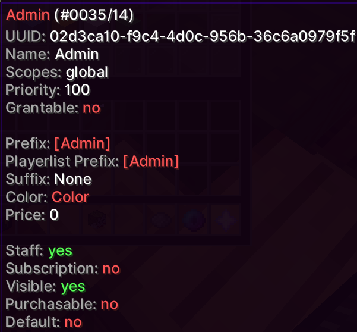

Ranks allow you to differentiate your players with prefixes, colors, permissions and more.

Each rank has a scope which determines which servers they will apply on. The scope can be `global`, which means the rank will apply on all servers.

Ranks can be invisible which means only the permissions apply to the player.

## Properties

Expand

Property          | Description
----------------- | --------------------------------------------------------
Name              | The rank's id, this is used in commands and some menus.
Display Name      | How the rank should display in menus, placeholders, etc.
Scopes            | What single/group of servers the rank should apply on.
Priority          | Order of ranks and what prefixes, etc, should be used.
Grantable         | If the rank should be able to be granted to players.
Prefix            | Used before player names, mostly used in chat.
Suffix            | Unlike the prefix, this goes after player names.
Playerlist Prefix | Same as the prefix but is only used in the tablist.
Color             | Used in menus and various other places aswell.
Purchaseable      | If the rank can be purchased in the in game coin shop.
Price             | How much the rank costs in the in game coin shop.
Subscription      | If the rank is a subscription in the in game coin shop.
Staff             | If the rank is a staff rank, used for various things.
Visible           | If disabled, the rank only applies permisisons.
Default           | Should the rank be given to new players.

## Permissions

Permissions define what the player can and cant do. They change how players interact with the server and it's plugins.

Same as above, permissions are also scoped, meaning they only work on specific servers.

### Permission Nodes

An example of a permission node is `core.command.ban` which allows the use of the /ban command.
A complete list of permissions can be found on the [permissions page](/Phoenix/Permissions).

:::tip Did you know?
A permission node can be prepended with a `-` to negate the permission.

For example, `-core.command.list` will disallow the default allowed use of `/list`
:::

### Inheritence

You can set a rank up so that it inherits permissions from other ranks.
If your rank inherits permissions from another, you will get the permissions from the inherited rank.

You can have multiple layers of inheritance, as long as `server.passthrough-children` is enabled in `global.yml`.

## Rank Editor

The rank editor menu allows you to edit the ranks using an in game gui.

Permission: `core.command.rank`

:::danger
Aside from the permission, this requires the player to be a [security user](/Phoenix/Features/Security).
Only give this to people that you trust as it is very dangerous in the wrong hands.
:::

Screenshot

## Commands

`<>` = Required `[]` = Optional

Command                                         | Permission          | Description
----------------------------------------------- | ------------------- | -----------------------------------------------
`/rank color <rank> <color>`                    | `core.command.rank` | Sets a rank's color.
`/rank create <name>`                           | `core.command.rank` | Creates a rank.
`/rank default <rank>`                          | `core.command.rank` | Sets the rank as the default rank.
`/rank delete <rank>`                           | `core.command.rank` | Deletes a rank.
`/rank display <rank>`                          | `core.command.rank` | Sets a rank's display name.
`/rank editor`                                  | `core.command.rank` | Opens the rank editor.
`/rank grantable <rank> [grantable]`            | `core.command.rank` | Toggles if the rank is grantable.
`/rank help [page]`                             | `core.command.rank` | Shows a list of rank commands.
`/rank info <rank>`                             | `core.command.rank` | Displays information about a rank.
`/rank inheritance add <rank> <inheritance>`    | `core.command.rank` | Adds a rank to inherit from.
`/rank inheritance delete <rank> <inheritance>` | `core.command.rank` | Removes an inherited rank.
`/rank inheritance list <rank> [page]`          | `core.command.rank` | Lists all inherited ranks.
`/rank list [page]`                             | `core.command.rank` | List the created ranks.
`/rank perm add <rank> <permission> [scopes]`   | `core.command.rank` | Adds a permission to a rank.
`/rank perm cmd add <rank> <command> [scopes]`  | `core.command.rank` | Adds a command to a rank.
`/rank perm cmd delete <rank> <command>`        | `core.command.rank` | Removes a command from a rank.
`/rank perm delete <rank> <permission>`         | `core.command.rank` | Removes a permission froma rank.
`/rank perm list <rank> [page]`                 | `core.command.rank` | List a ranks added permissions.
`/rank playerlist <rank> [prefix]`              | `core.command.rank` | Set the tablist prefix of a rank.
`/rank prefix <rank> [prefix]`                  | `core.command.rank` | Set a rank's prefix.
`/rank price <rank> <price>`                    | `core.command.rank` | Set a rank's price.
`/rank priority <rank> <priority>`              | `core.command.rank` | Set the priority of a rank.
`/rank purchasable <rank> [purchasable]`        | `core.command.rank` | Sets if the rank is purchasable.
`/rank rename <rank> <name>`                    | `core.command.rank` | Renames a rank.
`/rank scope add <rank> <scope>`                | `core.command.rank` | Adds a scope to a rank.
`/rank scope delete <rank> <scope>`             | `core.command.rank` | Removes a scope from a rank.
`/rank scope list <rank> [page]`                | `core.command.rank` | Lists a rank's scopes.
`/rank staff <rank> [staff]`                    | `core.command.rank` | Toggles if the rank is a staff rank.
`/rank subscription <rank> [subscription]`      | `core.command.rank` | Toggles if the rank is a subscription.
`/rank suffix <rank> [suffix]`                  | `core.command.rank` | Sets a rank's suffix.
`/rank tools child <rank>`                      | `core.command.rank` | Adds an inheritance to every rank.
`/rank tools child-from-start`                  | `core.command.rank` | Adds previous rank as inheritance to each rank.
`/rank tools clear-children`                    | `core.command.rank` | Clears inheritence from all ranks.
`/rank tools export`                            | `core.command.rank` | Exports ranks to `ranks.json`.
`/rank tools import`                            | `core.command.rank` | Imports ranks from `ranks.json`.
`/rank tools players <rank> [page]`             | `core.command.rank` | Lists all players in a rank.
`/rank visible <rank> [visible]`                | `core.command.rank` | Toggles if a rank is visible.