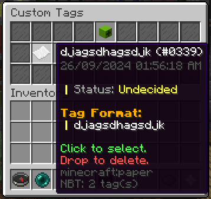
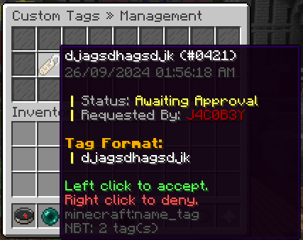

Players can pick tags to be added in their chat format.

Tags allow you to add customized player "suffixes" called ChatTags.

Tags allow your users to have more cosmetic options for their characters.
Each tag has a category, price, and priority.

## Custom Tags

Custom tags allow players to spend tokens to create custom tags.

After a player submits a custom tag, it needs to be approved by staff.

### Custom Tag Menu

This is where players can create custom tags.

Screenshot

### Custom Tag Admin Menu

This is where staff can approve custom tags.

Screenshot

### Custom Tag Commands

`<>` = Required `[]` = Optional

Command                                            | Permission                     | Description
-------------------------------------------------- | ------------------------------ | ----------------------------------------
`/customtagsadmin add-tokens <player> <amount>`    | `core.command.customtagsadmin` | Adds a tag token to a player.
`/customtagsadmin check-tokens <player>`           | `core.command.customtagsadmin` | Checks how many tag tokens a player has.
`/customtagsadmin list <player> [page]`            | `core.command.customtagsadmin` | Lists a player's custom tags.
`/customtagsadmin manage`                          | `core.command.customtagsadmin` | Opens the custom tag manage menu.
`/customtagsadmin remove-tokens <player> <amount>` | `core.command.customtagsadmin` | Removes tag tokens from a player.

## Commands

`<>` = Required `[]` = Optional

Command                                               | Permission                   | Description
----------------------------------------------------- | ---------------------------- | ------------------------------------------------------------------
`/tags create <name>`                                 | `core.command.chattagsadmin` | Creates a tag.
`/tags tag <name> <prefix>`                           | `core.command.chattagsadmin` | Sets the tag's display tag.
`/tags delete <name>`                                 | `core.command.chattagsadmin` | Deletes a tag.
`/tags list [page]`                                   | `core.command.chattagsadmin` | Allows you to list the currently available Tags.
`/tags tools export`                                  | `core.command.chattagsadmin` | Allows you to EXPORT your Tags to a .JSON file.
`/tags tools import`                                  | `core.command.chattagsadmin` | Allows you to IMPORT Tags from a .JSON file.
`/tags category create <name>`                        | `core.command.chattagsadmin` | Allows you to create a Tag category.
`/tags category default <category>`                   | `core.command.chattagsadmin` | Allows you to set the default category for the Tags menu.
`/tags category delete <category>`                    | `core.command.chattagsadmin` | Allows you to delete the Tag category.
`/tags category list [page]`                          | `core.command.chattagsadmin` | Allows you to list the available Tag categories.
`/tags priority <category> <priority>`                | `core.command.chattagsadmin` | Allows you to set a preferred priority for a Tag category.
`/tags tags add <category> <tag>`                     | `core.command.chattagsadmin` | Allows you to add a Tag to a category.
`/tags tags delete <category> <tag>`                  | `core.command.chattagsadmin` | Allows you to delete a Tag from a category.
`/tags tags list <category> [page]`                   | `core.command.chattagsadmin` | Allows you to list the available Tags on a category.
`/tags tags visible <category> <hidden [true/false]>` | `core.command.chattagsadmin` | Allows you to set if the category is visible to the public or not.
`/tags price <tag> <price>`                           | `core.command.chattagsadmin` | Allows you to set a price for a Tag.
`/tags priority <name> <weight>`                      | `core.command.chattagsadmin` | Allows you to set the preferred priority for a Tag.
`/tags purchasable <tag> <purchasable [true/false]>`  | `core.command.chattagsadmin` | Allows you to set if the Tag is purchasable or not.
`/tags color <tag> <color>`                           | `core.command.chattagsadmin` | Allows you to set the color of the Tag (NOT THE PREFIX).
