The Phoenix web editor (pxEditor) allows you to edit ranks, tags and chat filters
online using a convenient online interface.

## Showcase

Rank Screenshots

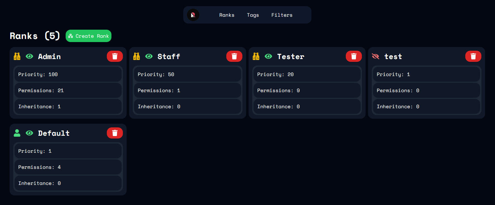
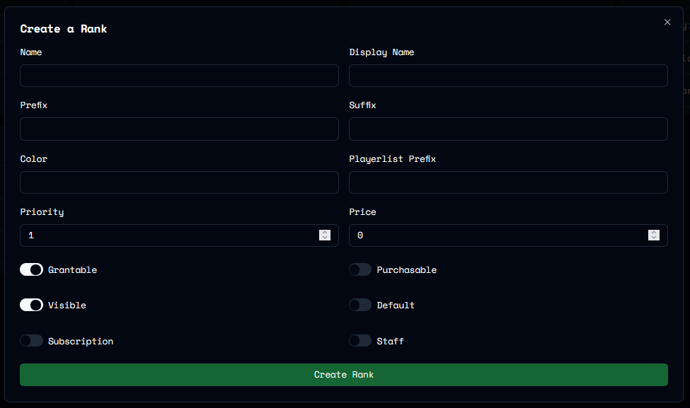
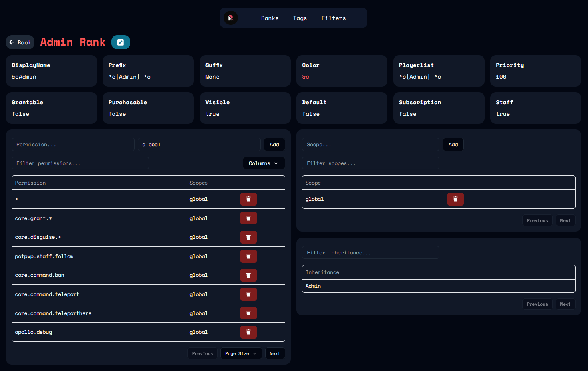
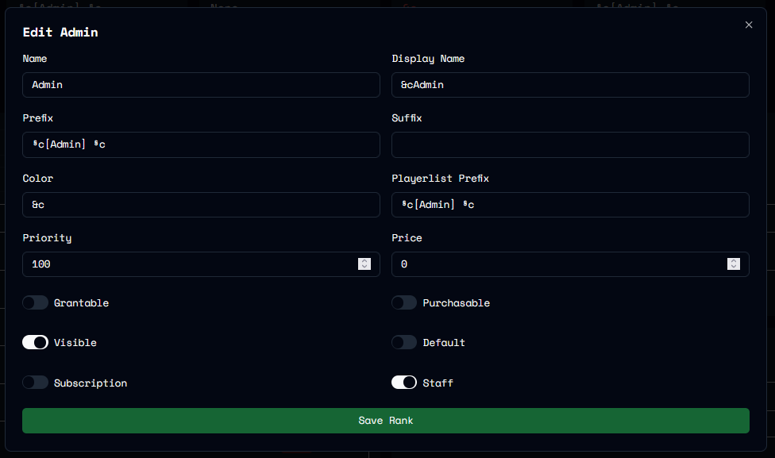

Tag Screenshots

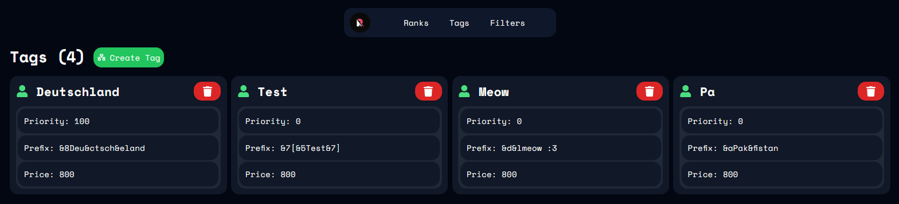
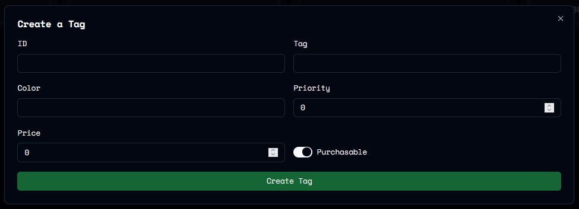
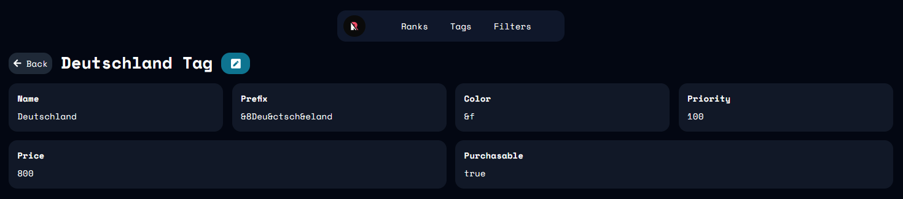
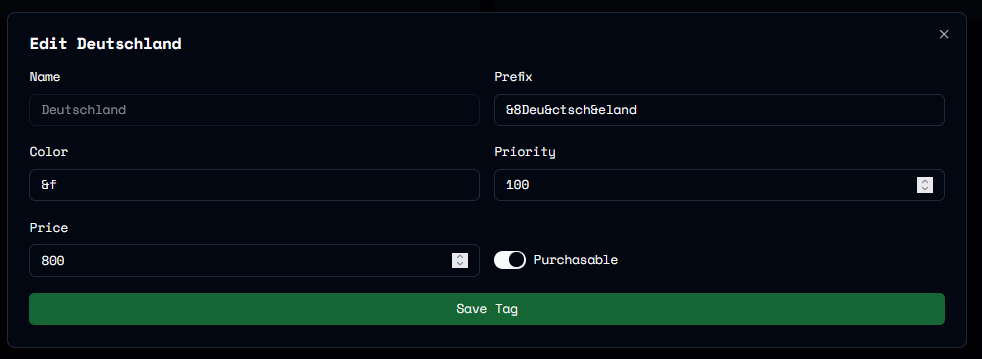

Filter Screenshots

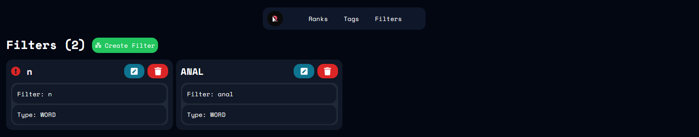
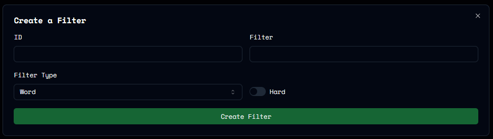
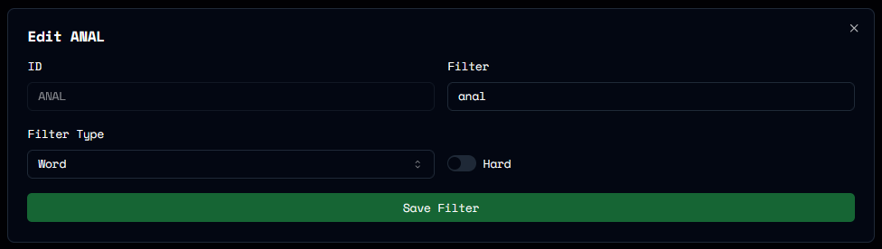

## Sessions

When you open the web editor using `/phoenix editor` it creates a session which expires after 24 hours.

If the editor changes are applied using the `/phoenix editor-update` command the session will close.

## Commands

`<>` = Required `[]` = Optional

Command                  | Permission                    | Description
------------------------ | ----------------------------- | --------------------------------------------
`/phoenix editor`        | `core.command.phoenix.editor` | Starts an editor session.
`/phoenix editor-update` | `core.command.phoenix.editor` | Pulls changes and closes the editor session.
`/phoenix editor-close` | `core.command.phoenix.editor` | Abandons changes and closes the editor session.
